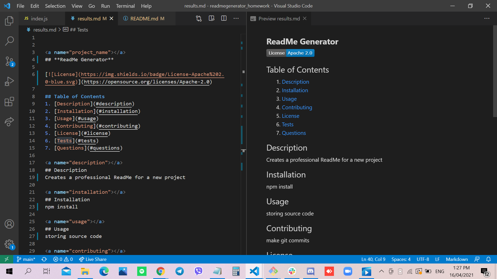

# ReadMe Generator

## Site Picture


## Technologies Used
- Javascript - adds special effects on pages
- Node.js - an open source server environment that uses JavaScript on the server
- GitBash - for cloning repository and pushing code to GitHub
- GitHub - holds repository that deploys to GitHub Pages

## Summary
This file contains a generated ReadMe. It also contains code that was created using Javascript and Node.js. 

## Code Snippet
```html
const questions = [
  { type: 'input', message: 'What is your GitHub username?', name: 'gitHub' },
  { type: 'input', message: 'What is your email address?', name: 'email' },
  { type: 'input', message: 'What is your project\'s name?', name: 'project_name' },
  { type: 'input', message: 'Please write a short description of project:', name: 'description' },
  { type: 'list', message: 'What kind of license should your project have?', name: 'license', choices: ['MIT', 'APACHE 2.0', 'GPL 3.0', 'BSD 3', 'None'] },
  { type: 'input', message: 'What command should be run to install dependencies?', name: 'installation' },
  { type: 'input', message: 'What command should be run to run tests?', name: 'tests' },
  { type: 'input', message: 'What does the user need to know about using the repo?', name: 'usage' },
  { type: 'input', message: 'What does the user need to know about contributing to the repo?', name: 'contributing' },
];
    ```

```html
<html>

</html>
```
## Video Link
https://drive.google.com/file/d/1AOnAlzFTj9AlyiZ7G_nrQ1pRyJAa7sVX/view

## Author Links 
[LinkedIn](https://www.linkedin.com/in/rosario-miranda-b81170132/)<br />
[GitHub](https://github.com/rtmiranda18)
